# 🚗 Intelligent Monocular Forward-Vision System (IMFS)

**IMFS** (Intelligent Monocular Forward-Vision System) is a deep learning system for estimating the distance to lead vehicles using a single monocular camera. The system implements a 3-branch neural network architecture that fuses full scene imagery, vehicle patches, and geometric features to achieve accurate distance estimation suitable for real-time deployment.

---

## 🎯 The Challenge

Determining lead vehicle distances is crucial for analyzing driver behavior in autonomous and assisted driving research. However, the high costs associated with LiDAR and RADAR technology pose a significant barrier to many researchers. **Argonne National Laboratory**, one of the U.S. Department of Energy's 17 national labs, needed a cost-effective alternative for their Connected and Automated Vehicle (CAV) research program.

**The Problem:** 💰 How can I provide reliable, real-time distance estimation using only monocular video from common hardware like dashcams—without expensive LiDAR/RADAR systems?

**The Opportunity:** ✨ Create an accessible and scalable solution that delivers accurate distance estimation using deep learning and geometric features, enabling widespread adoption in driver behavior research.

---

## 💡 My Solution: A Hybrid 3-Branch Architecture

I designed a novel hybrid approach that combines the power of deep learning with geometric priors. Unlike traditional monocular depth estimation, my architecture fuses three complementary information sources:

1. **🖼️ Full Scene Understanding** - Processes the entire image to capture contextual information
2. **🚙 Vehicle-Specific Features** - Focuses on the detected lead vehicle patch
3. **📐 Geometric Priors** - Leverages 10 calibrated features from camera parameters and bounding box geometry

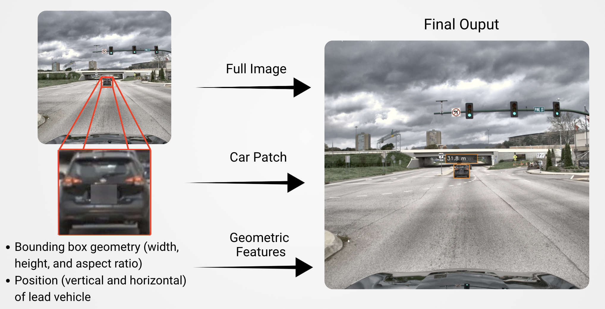

This 3-branch fusion enables robust distance estimation that rivals expensive sensor-based systems, all while running in real-time on standard hardware.

---

## 🛣️ The Journey: From Data to Deployment

### 📊 Understanding the Data

I worked with the **Argonne National Laboratory dataset**—a PII-filtered, proprietary collection of **19,000+ real-world dashcam images** from LA, Nashville, and Chattanooga. Ground truth distances were synchronized from LiDAR and Radar sensors, providing accurate labels for training.

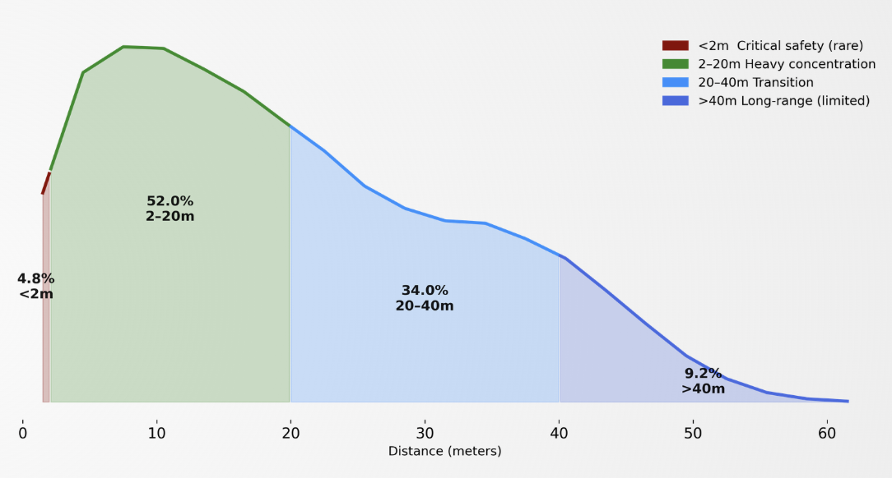

**Key Insights:**
- 📍 Heavy concentration in 0-30m range (typical city driving)
- ⚠️ Critical safety range underrepresented (only 4.8% under 2m)
- 🔭 Long-range samples (>40m) are limited—presenting challenges for far-distance estimation

This distribution shaped my model design, emphasizing accuracy in the most common distance ranges while maintaining performance across the full spectrum.

### 🔧 Preprocessing: Making Images Model-Ready

Raw dashcam images present numerous challenges: lens distortion, varying lighting conditions, and inconsistent contrast. I developed a comprehensive preprocessing pipeline to address these issues:

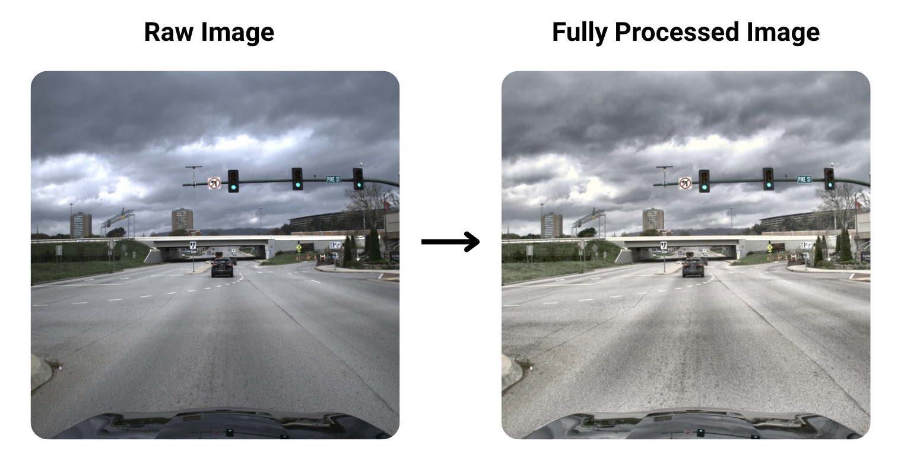

**The Pipeline:**
1. **🔍 Lens Undistortion** - Corrects barrel/pincushion distortion using camera calibration
2. **🎨 White Balance** - Fixes color cast from different lighting conditions
3. **✨ CLAHE** - Enhances local contrast while preventing over-amplification
4. **💡 Gamma Correction** - Non-linear brightness adjustment for better shadow detail

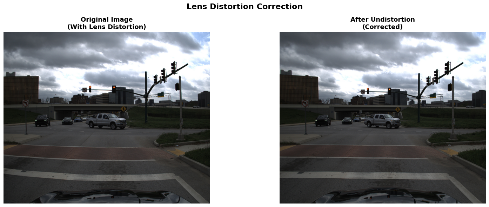
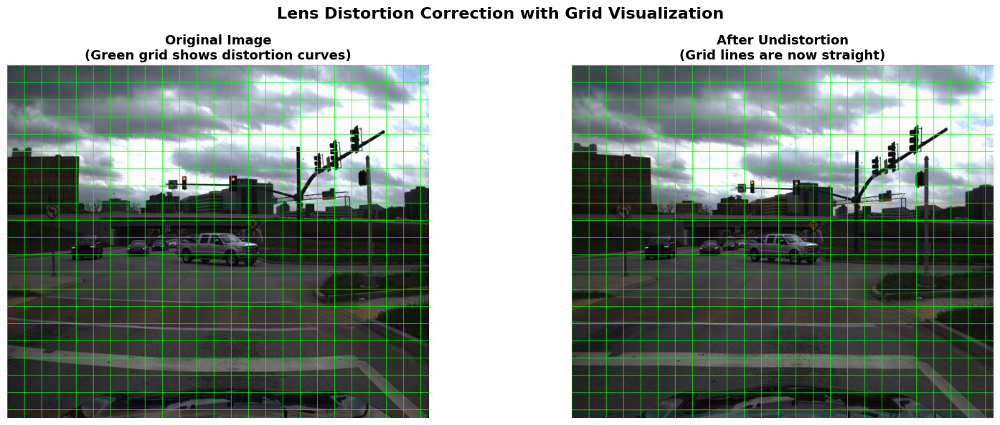

### 🎯 Finding the Lead Vehicle

With multiple vehicles in each frame, identifying the correct lead vehicle is crucial. I developed a multi-stage detection system:

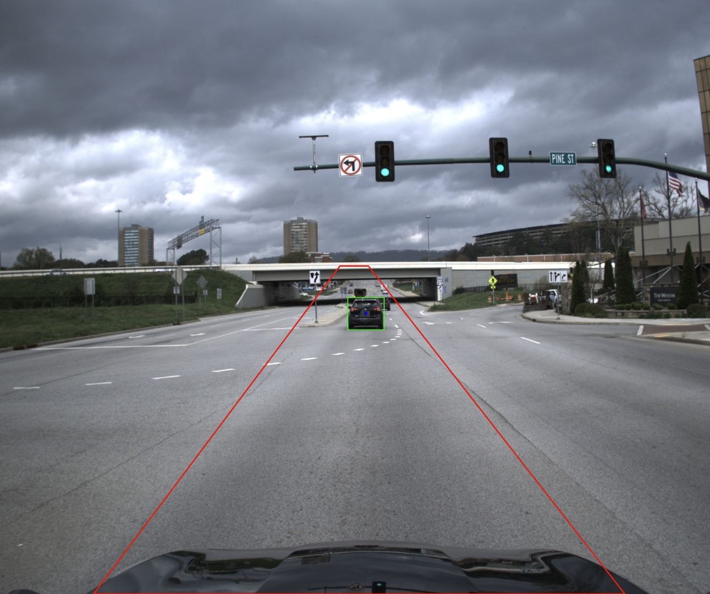

**My Approach:**
1. **📍 ROI Polygon Filtering** - Restricts detection to the drivable area
2. **🤖 YOLOv8 Detection** - Real-time vehicle detection with accurate bounding boxes
3. **🧮 Smart Scoring** - Combines closeness (70%), size (20%), and alignment (10%) to select the best candidate
4. **✂️ Hood Exclusion** - Removes bottom 20% (training) or 9% (inference) to avoid false detections

This multi-stage approach ensures the system consistently identifies the primary lead vehicle, even in complex traffic scenarios.

### 🔄 Data Augmentation: Building Robustness

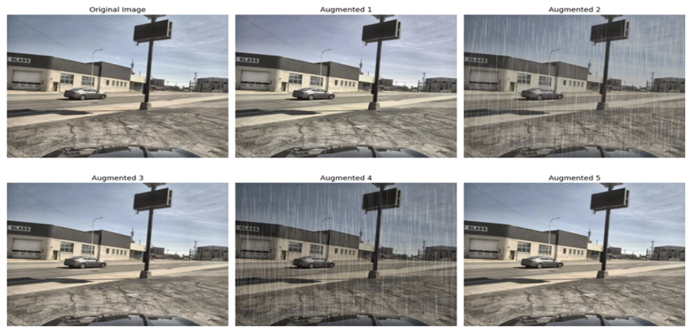

To improve model generalization, I applied data augmentation techniques that simulate real-world variations in driving conditions. This helped the model handle diverse lighting, weather, and road scenarios.

---

## 🤖 The Models: Two Paths to Success

I developed two model variants, each optimized for different use cases:

### 💪 Heavyweight Model - Production-Ready Accuracy

- **Architecture:** EfficientNetB4 (full image) + EfficientNetB3 (car patch) + Geometric features
- **Performance:** 1.41m MAE, 104ms latency, 9.7 FPS
- **Use Case:** Offline analysis, research, and scenarios where accuracy is prioritized

### ⚡ Lightweight Model - Real-Time Edge Deployment

- **Architecture:** MobileNetV3-Small (full image) + Custom CNN (car patch) + Geometric features
- **Performance:** 1.68m MAE, 32ms latency, 31+ FPS
- **Use Case:** Real-time inference, edge devices, mobile applications

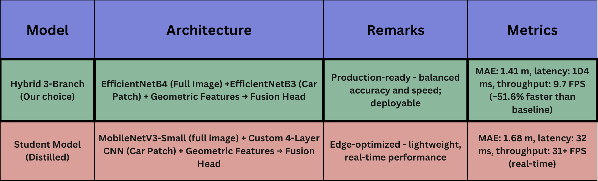

**Key Achievement:** Both models exceeded my target metrics:
- ✅ **Latency:** 32ms (68% faster than 100ms target)
- ✅ **Model Size:** ~4.2 MB (96% smaller than 100 MB target)
- ✅ **Accuracy:** 1.68m MAE (16% better than 2.00m target)

---

## 📈 Results: Exceeding Expectations

My comprehensive evaluation revealed that the lightweight model not only met but exceeded all performance targets while maintaining competitive accuracy:

| Model | MAE (m) | Latency (ms) | Throughput (FPS) | Parameters | Use Case |
|-------|---------|--------------|------------------|-----------|----------|
| **Heavyweight** | 1.41 | 104 | 9.7 | 20.2M | Production-ready, balanced accuracy and speed |
| **Lightweight** | 1.68 | 32 | 31+ | 1.08M | Edge-optimized, real-time performance |

### Detailed Performance Analysis

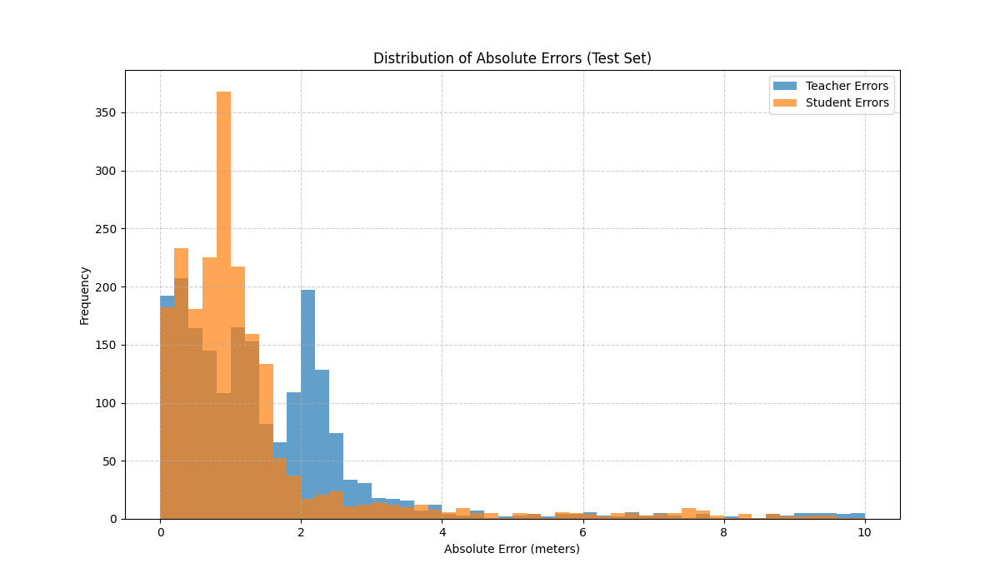
*Error distribution histogram showing model prediction errors*

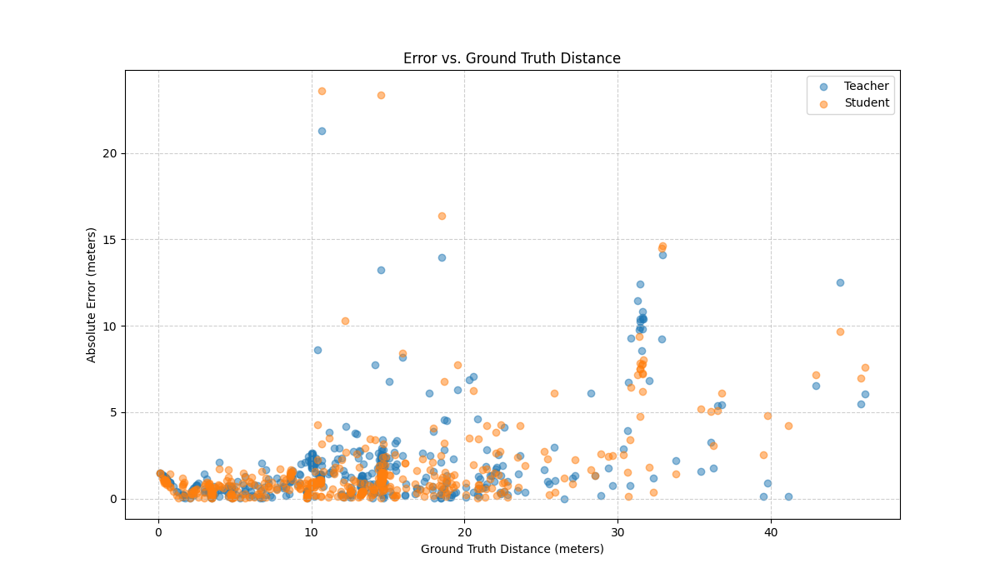
*Scatter plot showing error magnitude across different ground truth distances*

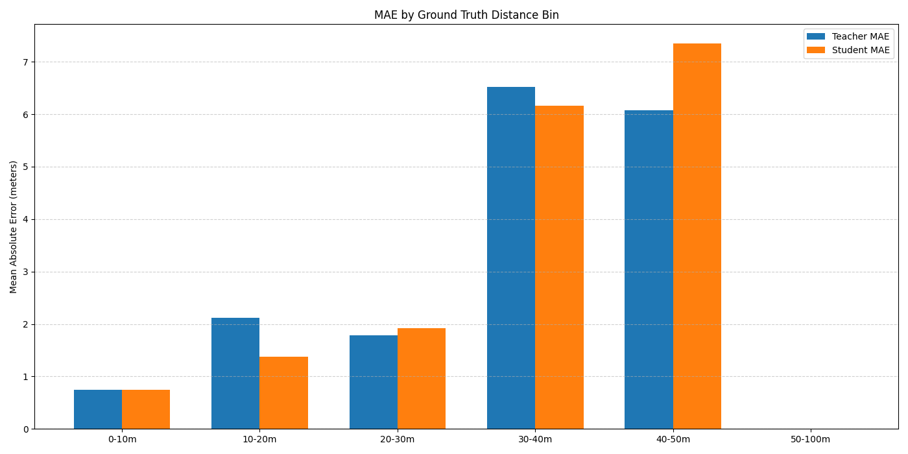
*Mean Absolute Error (MAE) broken down by distance ranges*

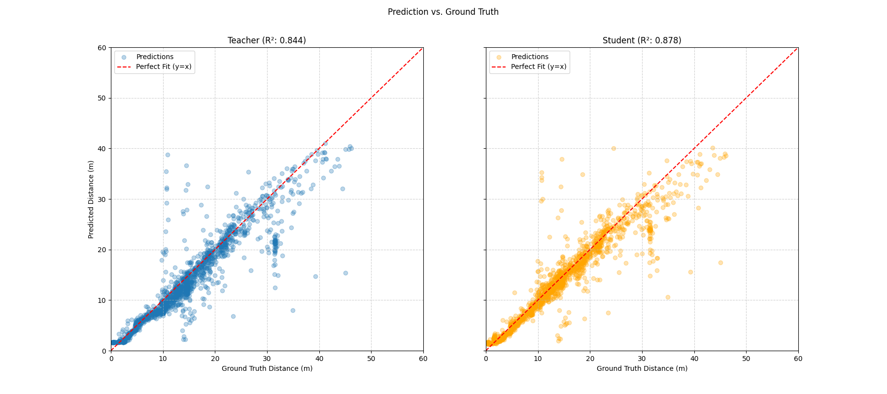
*Predicted distances vs ground truth distances with R² scores*

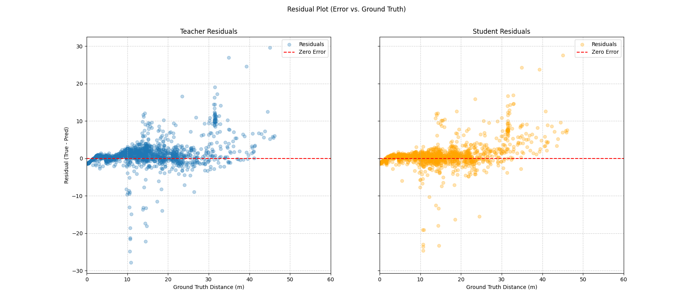
*Residual analysis showing prediction errors across distance ranges*

**Key Findings:**
- **Heavyweight Model:** Production-ready with balanced accuracy (1.41m MAE) and speed (9.7 FPS), **51.6% faster** than baseline research models
- **Lightweight Model:** Real-time capable with **31+ FPS** throughput, suitable for edge deployment on resource-constrained devices
- **Architecture Advantage:** The 3-branch hybrid approach enables robust distance estimation without expensive LiDAR/RADAR hardware

---

## 🏗️ Technical Architecture

### 🔬 Model Architecture Details

**Heavyweight Model:**
- **Branch 1**: EfficientNetB4 (1792 features) → 512 → 256 → 128-dim head
- **Branch 2**: EfficientNetB3 (1536 features) → 256 → 128 → 64-dim head
- **Branch 3**: Geometric features (10) → 64 → 32 → 32-dim MLP
- **Fusion**: 224-dim → 256 → 128 → 64 → 32 → 1
- **Parameters**: ~20.2M total, ~440K trainable (initially)

**Lightweight Model:**
- **Branch 1**: MobileNetV3-Small (576 features) → Custom head
- **Branch 2**: Custom 4-layer CNN (64 features)
- **Branch 3**: Geometric features (10) → 16-dim MLP (shared)
- **Fusion**: 656-dim → 128 → 64 → 1
- **Parameters**: ~1.08M total

### 🔧 Preprocessing Pipeline

The preprocessing pipeline consists of four stages applied sequentially:

1. **Lens undistortion** (camera calibration)
   - Corrects barrel/pincushion distortion using camera calibration parameters
   - Updates camera matrix with new focal lengths after undistortion

2. **White balance correction** (Gray World algorithm)
   - Assumes average scene color is gray
   - Corrects color cast from lighting conditions

3. **CLAHE** (Contrast Limited Adaptive Histogram Equalization)
   - Enhances local contrast while preventing over-amplification
   - Applied only to the L-channel in LAB color space

4. **Gamma correction**
   - Non-linear brightness adjustment
   - Brightens shadows and mid-tones more than highlights
   - Prevents overexposure in bright areas

### 🎯 Lead Vehicle Detection

The system employs a multi-stage approach to identify and select the primary lead vehicle:

1. **Region Of Interest (ROI) Polygon**
   - Restricts detection to the drivable area, emphasizing the lead vehicle zone
   - Filters out vehicles in adjacent lanes and irrelevant background objects

2. **YOLOv8 - Real-Time Object Detection**
   - Detects vehicles in real time using YOLOv8 medium model
   - Provides accurate bounding boxes for all detected vehicles
   - Vehicle classes: car, bus, truck, motorcycle
   - **Detection runs on preprocessed images** (matching training pipeline)

3. **Center Focus Heuristic**
   - Gives priority to vehicles near the vertical center of the frame
   - Helps isolate the true lead vehicle from side vehicles

4. **Bottom-Crop Heuristic**
   - Removes the bottom 20% of the frame (during training) or 9% (during inference)
   - Avoids hood reflections, occlusions, and irrelevant foreground clutter
   - Prevents false detections from vehicle hoods or dashboard reflections

5. **Scoring System**
   - Combines multiple factors to select the best lead vehicle candidate:
     - **Closeness** (70% weight): Vertical position in frame
     - **Size** (20% weight): Relative bounding box area
     - **Alignment** (10% weight): Horizontal center deviation

---

## 🚀 Getting Started

### 📦 Installation

1. Clone the repository:
```bash
git clone https://github.com/codex83/imfs-distance-estimation.git
cd imfs-distance-estimation
```

2. Create a virtual environment:
```bash
python -m venv venv
source venv/bin/activate  # On Windows: venv\Scripts\activate
```

3. Install dependencies:
```bash
pip install -r requirements.txt
```

4. Configure camera calibration (if needed):
   - Edit `src/config.py` with your camera parameters
   - Camera calibration can be performed using OpenCV's calibration tools

### 🤖 Pretrained Models

Pretrained model checkpoints are available for both the Heavyweight and Lightweight models. These models were trained on the Argonne National Laboratory dataset.

**Model Availability:**
- **⚡ Lightweight Model**: Available upon request (recommended for real-time inference)
- **💪 Heavyweight Model**: Available upon request (recommended for offline analysis)

**Request Access:** Please contact [htj8@outlook.com](mailto:htj8@outlook.com) to request access to pretrained model checkpoints.

**Note:** Model checkpoints are not included in this repository due to size constraints. Alternatively, you can train the models from scratch using the training scripts provided below.

### 💻 Usage

#### 🎓 Training

**Train Heavyweight Model:**
```bash
python scripts/train_heavyweight.py \
    --detection-json-dir /path/to/detection/jsons \
    --train-image-dir /path/to/train/images \
    --val-image-dir /path/to/val/images \
    --test-image-dir /path/to/test/images \
    --checkpoint-dir /path/to/checkpoints \
    --num-epochs 50 \
    --batch-size 64
```

**Train Lightweight Model:**
```bash
python scripts/train_lightweight.py \
    --detection-json-dir /path/to/detection/jsons \
    --train-image-dir /path/to/train/images \
    --val-image-dir /path/to/val/images \
    --test-image-dir /path/to/test/images \
    --checkpoint-dir /path/to/checkpoints \
    --num-epochs 50 \
    --batch-size 64
```

#### 📊 Evaluation

**Compare Both Models:**
```bash
python scripts/evaluate.py \
    --mode compare \
    --heavyweight-checkpoint /path/to/heavyweight.pt \
    --lightweight-checkpoint /path/to/lightweight.pt \
    --detection-json-dir /path/to/detection/jsons \
    --test-image-dir /path/to/test/images
```

#### 🔮 Inference

**Single Image:**
```bash
python scripts/inference_image.py \
    --model-type lightweight \
    --checkpoint-path /path/to/lightweight.pt \
    --input /path/to/image.jpg \
    --output /path/to/output.jpg
```

**Video File:**
```bash
python scripts/inference_video.py \
    --model-type lightweight \
    --checkpoint-path /path/to/lightweight.pt \
    --input /path/to/video.mp4 \
    --output /path/to/output.mp4 \
    --save-json
```

**Process Directory:**
```bash
python scripts/inference_image.py \
    --model-type lightweight \
    --checkpoint-path /path/to/lightweight.pt \
    --input /path/to/images/ \
    --output /path/to/output/ \
    --directory
```

---

## 📁 Project Structure

```
.
├── src/
│   ├── models/          # Model architectures (Heavyweight, Lightweight)
│   ├── data/            # Dataset classes and dataloaders
│   ├── preprocessing/   # Image preprocessing pipeline
│   ├── detection/       # Lead vehicle detection (YOLOv8)
│   ├── training/        # Training utilities and scripts
│   ├── evaluation/      # Model evaluation and comparison
│   └── inference/       # Real-time and offline inference
├── scripts/             # CLI entry points
├── docs/                # Documentation and figures
└── archive/             # Obsolete/experimental files and notebooks (reference)
```

---

## 🌟 Impact & Future Work

**IMFS** successfully demonstrates that monocular vision can provide accurate, real-time distance estimation suitable for driver behavior research. By achieving **31+ FPS** on standard hardware with **1.68m MAE**, I've created a viable alternative to expensive sensor-based systems.

**Client Statement:**
> "We are very thankful to the team for adding this capability to our research toolkit."

The lightweight model's real-time performance opens possibilities for:
- 📊 Real-time driver behavior analysis
- 📱 Edge device deployment
- 🌐 Mobile/web application integration
- 💰 Cost-effective research platforms

---

## 🙏 Acknowledgments

- **🏛️ Argonne National Laboratory** - Dataset and research collaboration
  - Kevin Stutenberg (Project Lead)
  - Michael Pamminger (Technical Research)
  - Yihe Chen (Technical Implementation)
- **🎓 University of Chicago** - Research support and academic guidance

